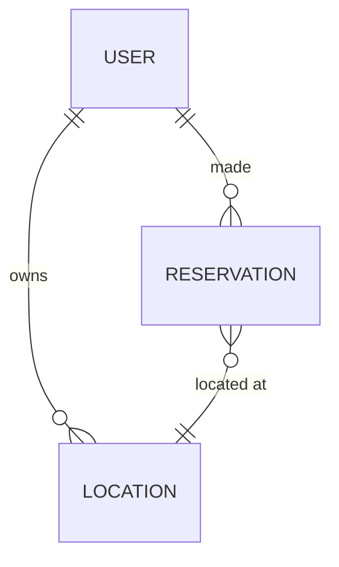

# RESTPasTrop

API made accprding to those [Specifications](https://gist.github.com/Vagahbond/3d75e2901373010f2f73e2856e89f753) to give my students an example of how they could do a project I gave them.

** /!\ THIS IS STILL WORK IN PROGRESS /!\ **

Tasks :

- [x] Boilerplate
  - [x] Files Architecture
  - [x] Users CRUD
  - [x] Reservations CRUD
  - [x] Locations CRUD
  - [x] Error Handling
  - [x] Documentation
- [ ] Validation
  - [x] Locations Validation
  - [ ] Users Validation
  - [ ] Reservations Validation
- [ ] Rights management
  - [ ] Authorization
  - [ ] Authentication
- [ ] Documentation
  - [ ] Users
    - [ ] Schema
    - [ ] Endpoints
  - [ ] Locations
    - [x] Schema
    - [ ] Endpoints
  - [ ] Reservations
    - [ ] Schema
    - [ ] Endpoints
- [ ] Buisness logic
  - [ ] Users
  - [ ] Reservations
  - [ ] Locations

## Architecture

Architecture was made according to the course with controller, repository and service layers and an added model for passing data between those.

```
.
├── bun.lockb
├── common
│   ├── db_handler.ts
│   ├── http_errors.ts
│   ├── middlewares
│   │   ├── error_middleware.ts
│   │   └── id_param_guard_middleware.ts
│   └── swagger_handler.ts
├── index.ts
├── locations
│   ├── controller.ts
│   ├── model.ts
│   ├── repository.ts
│   └── service.ts
├── package.json
├── reservations
│   ├── controller.ts
│   ├── model.ts
│   ├── repository.ts
│   └── service.ts
├── tsconfig.json
├── tsconfig.tsbuildinfo
└── users
    ├── controller.ts
    ├── model.ts
    ├── repository.ts
    └── service.ts
```

## Documentation

Documentation is automatically generated using JSDOC in the code. It can be accessed through `/doc`.

## Insomnia

`insomnia.json` should contain a list of existing requests with documentation for them.

## REST

This project includes:

- Explicit HTTP method related to their actions
  - GET : retrieve
  - PATCH : modify
  - DELETE : remove
  - POST : create
- Explicit resources names : last relevant word in the URL is the type of data you should expect to get.
- HATEOAS : The API can be browsed using link it gives for each entity

## entities


